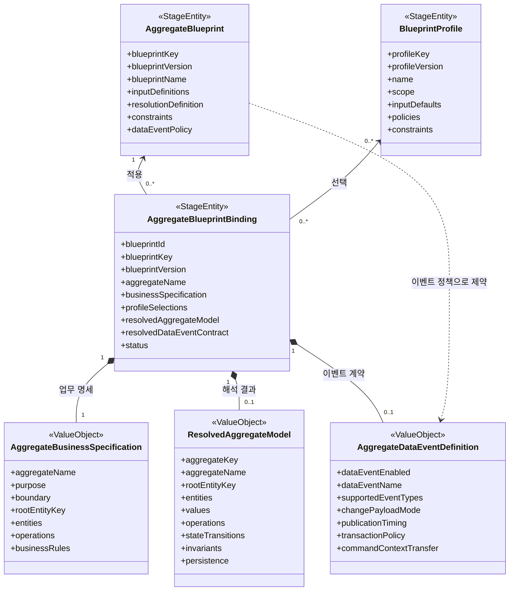

# Aggregate Blueprint AI 구현 계약

## 1. 문서의 지위

이 문서는 `maro-back`에서 Aggregate Blueprint 모델과 이를 소비하는 생성 기능을 구현할 때 사용하는 규범 문서다.

이 문서에서 사용하는 표현은 다음 의미를 가진다.

- **반드시(MUST)**: 예외 없이 지켜야 하는 모델 계약이다.
- **금지(MUST NOT)**: 구현에 포함하면 안 되는 구조다.
- **권장(SHOULD)**: 특별한 근거가 없으면 따라야 한다.

구현 편의를 이유로 모델 경계나 의존 방향을 바꾸면 안 된다. 새로운 개념이 필요하면 먼저 Spec, 책임, 데이터 구조, 검증 규칙과 생성 영향을 문서화한 다음 사용자의 승인을 받아야 한다.

### 구현 기준선

현재 구조의 참조 구현은 저장소 루트 기준 다음 위치다.

- 모델: `../maro-domain/maro-domain/src/main/java/io/vizend/maro/domain/blueprint`
- 구조 설명: `../maro-domain/maro-domain/docs/aggregate-blueprint-model.md`

해당 경로에 접근할 수 있으면 구현 전에 반드시 현재 필드와 타입을 비교한다. 참조 구현을 그대로 복사하는 것만으로 작업을 끝내지 말고, 이 문서에 정의된 의존성·검증·생성 규칙과 `maro-back`의 API 호환성을 함께 확인한다. 기준선과 이 문서가 충돌하면 임의로 결정하지 말고 사용자에게 차이를 보고한다.

## 2. Blueprint의 정의

Aggregate Blueprint는 `PiAggregate`, `PiEntity`와 그 주변 모델을 만들기 전에 존재하는 재사용 가능한 중간 메타모델이다.

기존 방식은 사용자가 Entity 값을 직접 입력하고 Entity 생성 과정에서 Aggregate를 지정했다. Blueprint 방식은 반대 방향으로 동작한다.

1. Aggregate 수준의 공통 설계 기준을 Blueprint로 정의한다.
2. 사용자가 특정 업무 명세를 입력하고 Blueprint와 Profile을 선택한다.
3. 입력을 해석하여 Aggregate Root, Child Entity, Value, Operation, 상태 전이, 불변식과 영속 정책을 확정한다.
4. 확정된 설계를 이용해 Pi 모델을 생성한다.
5. 같은 버전의 Blueprint, Profile과 Binding 입력을 사용하면 같은 설계를 다시 생성할 수 있다. 단, Pi의 최종 lineage는 그 설계를 적용하는 실제 Drama/Pit/Geno 부모 계층에서 정한다.

Blueprint는 Pit이나 Pr의 구성 요소가 아니다. Blueprint가 먼저 존재하고 Pit을 포함한 생성 영역이 이를 소비한다.

```text
AggregateBlueprint + BlueprintProfile + AggregateBusinessSpecification
                              │
                              ▼
                 AggregateBlueprintBinding
                              │ validate / resolve
                              ▼
          ResolvedAggregateModel + AggregateDataEventDefinition
                              │ materialize (lineage 미지정)
                              ▼
             Pi CDO ── Geno 등록(실제 부모 lineage) ── Pi 모델
```

## 3. 의존성 방향

허용되는 의존 방향은 다음과 같다.

```text
blueprint model  ←  resolver/application layer  ←  geno materializer
```

다음 규칙을 반드시 지킨다.

- `io.vizend.maro.domain.blueprint..`는 Geno, Pit, Pr 모델을 import하지 않는다.
- Blueprint의 ID 생성, 검증, JSON 표현과 ValueObject 구조는 Blueprint 패키지 안에서 완결한다.
- `AggregateBlueprintMaterializer` 같은 하위 생성 어댑터만 Blueprint를 import한다.
- Materializer는 해석이 끝난 `ResolvedAggregateModel`을 Pi 모델로 변환한다.
- Materializer가 원본 자연어 업무 명세나 Profile 정책을 다시 해석하면 안 된다.
- Pit ID, Pr ID 또는 Pi 모델 ID를 Blueprint의 식별자로 사용하면 안 된다.
- Blueprint와 `ResolvedAggregateModel`은 최종 `lineageId` 또는 lineage 패턴을 소유하면 안 된다.
- Blueprint 내부 참조는 `aggregateKey`, `entityKey`, `fieldKey`, `objectKey` 같은 설계 키로 연결한다.

## 4. 패키지 구조

```text
io.vizend.maro.domain.blueprint.cm.entity
├── AggregateBlueprint.java
├── AggregateBlueprintBinding.java
├── BlueprintProfile.java
├── policy
│   └── AggregateBlueprintValidator.java
├── sdo
│   ├── AggregateBlueprintCdo.java
│   ├── AggregateBlueprintBindingCdo.java
│   └── BlueprintProfileCdo.java
└── vo
    ├── AggregateBusinessSpecification.java
    ├── ResolvedAggregateModel.java
    ├── AggregateResolutionDefinition.java
    ├── AggregateEntityResolutionRule.java
    ├── AggregateDataObjectTemplate.java
    ├── BlueprintFieldTemplate.java
    ├── AggregateDataEventDefinition.java
    ├── AggregateDataEventPolicy.java
    ├── BlueprintInputDefinition.java
    ├── BlueprintInputBinding.java
    ├── ProfileSelection.java
    └── ... 하위 설계 ValueObject

io.vizend.maro.feature.blueprint.aggregate.action
└── AggregateBlueprintMaterializer.java

io.vizend.maro.feature.geno.pit.action
└── BlueprintPitIrGenerationAction.java
```

구조 규칙은 다음과 같다.

- 독립적인 수명주기와 ID가 필요한 원본만 `StageEntity`로 둔다.
- Binding 내부의 업무 명세와 해석 결과는 재현 가능한 설계 스냅샷이므로 `ValueObject`로 둔다.
- 생성 입력은 `sdo`에, 순수 검증은 `policy`에 둔다.
- Pi 모델 변환기는 Blueprint 패키지 밖의 downstream 패키지에 둔다.

## 5. 핵심 모델과 필드 계약

### 5.1 AggregateBlueprint

모든 Aggregate에 재사용할 수 있는 공통 설계 기준이다. 특정 업무의 Aggregate 구조를 직접 담지 않는다.

활성 필드는 다음 목록으로 제한한다.

| 필드 | 책임 |
| --- | --- |
| `blueprintKey` | Blueprint 종류를 식별하는 버전 비종속 논리 키 |
| `blueprintVersion` | 동일 키 안에서 규칙을 고정하는 양의 버전 |
| `blueprintName` | 표시 이름 |
| `description` | 목적, 적용 예시와 사용 설명 |
| `inputDefinitions` | Binding이 받을 입력 스키마와 해석 규칙 |
| `resolutionDefinition` | 입력 키 매핑, ID·Version 필드와 SDO 템플릿을 포함한 실행 가능한 해석 계약 |
| `constraints` | 모든 해석 결과가 만족해야 하는 전역 제약 |
| `dataEventPolicy` | Binding별 이벤트 계약이 따라야 하는 공통 기준 |
| `bindings` | 이 Blueprint를 선택한 Binding의 조회용 역방향 관계 |

`bindings`는 객체 탐색 관계이며 반드시 `transient`로 선언한다. Binding의 `blueprintId`, `blueprintKey`, `blueprintVersion`이 영속성과 재현성의 기준이다.

다음 내용을 `AggregateBlueprint`에 두면 안 된다.

- 주문, 결제, 배송 등 특정 업무 용어
- 업무별 Entity와 Operation의 확정 구조
- 업무별 이벤트 이름과 값 결합 경로
- Pit, Pr 또는 Pi 모델 참조
- 검증·해석 의미가 정의되지 않은 범용 확장 맵

`resolutionDefinition`은 공통 Blueprint 규칙이며 특정 업무 Entity를 담지 않는다. Resolver는 `blueprintKey`로 구현을 선택하면 안 되고, 선택된 Blueprint 버전의 `resolutionDefinition`만 실행해야 한다. 해석 계약이 없는 이전 Blueprint는 다른 키 기반 기본값으로 보완하지 않고 명시적으로 실패시킨다.

### 5.1.1 AggregateResolutionDefinition

Blueprint가 어떤 입력을 최종 모델 속성에 결합하고, Entity의 ID·Version과 SDO를 어떻게 설계할지 정의한다.

| 구성 | 책임 |
| --- | --- |
| 입력 키 매핑 | `packagePath`, 모델 버전, Entity/CQRS/Store 유형을 어떤 `inputDefinitions` 키에서 읽을지 지정 |
| 기본 정책 | Profile 적용 전 잠금, 트랜잭션, 이벤트 payload·발행 시점과 수명주기 정책 지정 |
| `entityRule` | 업무 Identifier/Version 재사용 여부, fallback 기술 필드와 ID 생성 전략 지정 |
| `dataObjectTemplates` | Entity마다 생성할 CDO/UDO/DDO/RDO/FDO 종류, 이름, 필드 투영과 ID 전략 지정 |

SDO 템플릿은 문자열 코드나 범용 Map이 아니라 `AggregateDataObjectTemplate`의 제한된 Enum 규칙으로 표현한다. 업무 필드와 Entity 이름은 Binding의 업무 명세에서 오지만, 어떤 필드를 투영하고 어떤 SDO를 만들지는 Blueprint가 결정한다.

`AggregateResolutionDefinition`은 업무 객체의 기술 ID와 SDO 구조를 설계하지만 Pi의 runtime lineage는 설계하지 않는다. 동일한 Binding도 서로 다른 Pit에 적용될 수 있으므로 최종 lineage는 실제 부모 모델이 존재하는 Geno 등록 단계의 책임이다.

### 5.2 AggregateBlueprintBinding

하나의 업무 명세에 특정 Blueprint 버전과 Profile 버전을 적용하는 설계 작업 단위다.

| 필드 | 책임 |
| --- | --- |
| `blueprintId` | 선택한 Blueprint StageEntity ID |
| `blueprintKey` | Blueprint 논리 키 스냅샷 |
| `blueprintVersion` | 선택한 정확한 Blueprint 버전 |
| `aggregateName` | 설계 대상 Aggregate 이름 |
| `businessSpecification` | 사용자가 입력한 원본 업무 명세 |
| `inputBindings` | Blueprint 입력별 실제 값과 해석 상태 |
| `profileSelections` | Profile ID·키·버전·파라미터·우선순위 선택 |
| `resolvedAggregateModel` | 최종 Aggregate 구조 설계 |
| `resolvedDataEventContract` | 최종 데이터 이벤트 계약 |
| `validationResult` | 가장 최근 입력 또는 최종 설계 검증 결과 |
| `status` | Binding 수명주기 상태 |
| `blueprint` | 선택한 Blueprint의 조회용 객체 관계 |
| `profiles` | 선택한 Profile들의 조회용 객체 관계 |

`blueprint`와 `profiles`는 반드시 `transient`로 선언한다. 버전 고정 참조인 `blueprintId/key/version`과 `profileSelections`를 제거하거나 객체 관계로 대체하면 안 된다.

Binding은 다음 두 단계를 구분해야 한다.

- **입력 단계**: 업무 명세, Blueprint 입력, Profile 선택을 보관하고 `validateInput()`을 수행한다.
- **해석 단계**: `ResolvedAggregateModel`과 이벤트 계약을 보관하고 `validateDesign()`을 수행한다.

Binding은 PR이나 Pit에 소유되지 않는 독립 `StageEntity`다. `prId`, `pitId`, `dramaId`를 Binding 필드로 추가하지 않는다. 새 PR의 Pit snapshot은 기존 Binding ID를 그대로 참조한다.

같은 Aggregate 업무 설계를 변경할 때는 새 Binding을 만들지 않고 기존 Binding의 `businessSpecification`, `inputBindings`, `profileSelections`, `resolvedAggregateModel`, `resolvedDataEventContract`, `validationResult`, `status`를 함께 수정한다. `blueprintId/key/version`과 `aggregateName`은 Binding 정체성이므로 수정하지 않는다. StageEntity의 버전은 동시 수정 충돌을 검출하는 데 사용한다.

### 5.3 BlueprintProfile

여러 Binding에서 재사용하는 기본값과 정책 묶음이며 독립 `StageEntity`다.

| 필드 | 책임 |
| --- | --- |
| `profileKey` | Profile 종류의 논리 키 |
| `profileVersion` | Profile 내용의 고정 버전 |
| `name` | 표시 이름 |
| `description` | 설계 방향과 적용 목적 |
| `scope` | Profile 적용 가능 범위 |
| `inputDefaults` | 사용자가 생략한 Blueprint 입력의 기본값 |
| `policies` | 대상 경로에 값을 기본 또는 강제 적용하는 정책 |
| `constraints` | Profile 적용 결과의 유효성 제약 |
| `tags` | 검색과 분류용 비기능 메타데이터 |
| `active` | Binding 생성 또는 수정에서 이 Profile 버전을 선택할 수 있는지 여부 |
| `bindings` | 이 Profile 버전을 선택한 Binding의 조회용 역방향 관계 |

`bindings`는 반드시 `transient`로 선언한다. Profile은 특정 Blueprint를 소유하거나 참조하지 않는다. Profile에 `blueprintId`를 추가하면 안 된다.

### 5.4 AggregateBusinessSpecification

사용자가 업무 언어로 입력하는 원본이다. 다음 정보를 잃지 않고 보존해야 한다.

- 업무 명세 식별 키와 제목
- Aggregate 이름, 목적과 일관성 경계
- 원본 업무 서술
- Aggregate Root 후보
- Root 및 Child Entity 후보와 주요 필드
- Command, Query와 도메인 행위
- 전역 업무 규칙과 주요 생명주기 상태

이 모델은 입력 원본이다. 해석 과정에서 이를 `ResolvedAggregateModel`로 덮어쓰면 안 된다.

### 5.5 ResolvedAggregateModel

Java 클래스명은 `ResolvedAggregateModel`이다. 문서나 대화에서 `ResolvedModel`이라고 부르더라도 새 클래스를 만들지 않는다.

이 모델은 다음 최종 설계를 소유한다.

- Aggregate 키, 이름, 패키지 경로와 모델 버전
- 유일한 Root Entity 키
- Root 및 Child `AggregateEntityDefinition`
- `AggregateValueDefinition`
- `AggregateOperationDefinition`
- `AggregateStateTransitionDefinition`
- `AggregateInvariantDefinition`
- `AggregatePersistenceDefinition`

모든 내부 참조는 생성 전에도 안정적인 논리 키로 연결한다. Root가 정확히 하나인지, 참조 키가 존재하는지, 소유 관계가 순환하지 않는지를 검증해야 한다.

### 5.6 AggregateDataEventDefinition

Binding별로 확정되는 데이터 이벤트 계약이다.

반드시 다음을 표현할 수 있어야 한다.

- 이벤트 사용 여부와 이벤트 이름
- 이벤트, Aggregate, Entity, Entity 타입과 버전의 값 결합 경로
- `Create`, `Update`, `Delete` 지원 범위
- `BeforeAfter` 또는 `FieldChangeSet` 변경 payload 방식
- 발생 시각과 Command 문맥 결합
- 발행 시점과 저장-발행 트랜잭션 정책
- 멱등 키와 Command 문맥 전달 방식

Blueprint의 `AggregateDataEventPolicy`는 허용 범위와 필수 조건만 정한다. `AggregateDataEventDefinition`의 업무별 값과 결합 경로를 Blueprint에 올리면 안 된다.

## 6. 핵심 UML

구현 키워드가 아니라 도메인 관계만 표현한다.



## 7. 하위 모델 구조

```text
AggregateBusinessSpecification
├── BusinessEntitySpecification[*]
│   └── BusinessFieldSpecification[*]
├── BusinessOperationSpecification[*]
├── businessRules[*]
└── lifecycleStates[*]

ResolvedAggregateModel
├── AggregateEntityDefinition[*]
│   ├── AggregateFieldDefinition[*]
│   ├── AggregateDataObjectDefinition[*]
│   └── BlueprintStoreMethod[*]
├── AggregateValueDefinition[*]
├── AggregateOperationDefinition[*]
├── AggregateStateTransitionDefinition[*]
├── AggregateInvariantDefinition[*]
└── AggregatePersistenceDefinition

AggregateBlueprint
└── AggregateResolutionDefinition
    ├── AggregateEntityResolutionRule
    │   ├── BlueprintFieldTemplate generatedIdentifierField
    │   ├── BlueprintIdStrategy businessIdentifierStrategy
    │   ├── BlueprintIdStrategy generatedIdentifierStrategy
    │   └── BlueprintFieldTemplate generatedVersionField
    └── AggregateDataObjectTemplate[*]

AggregateBlueprintBinding
├── AggregateBusinessSpecification
├── BlueprintInputBinding[*]
├── ProfileSelection[*]
├── ResolvedAggregateModel
├── AggregateDataEventDefinition
└── BlueprintValidationResult
```

`ValueObject` 하위 구조는 Binding의 재현 가능한 설계 데이터다. 이 소유 구조를 조회용 관계로 오해하여 `transient`로 바꾸면 안 된다.

## 8. Binding 해석 순서

Resolver 또는 Application Service는 반드시 다음 순서를 따른다.

1. `blueprintId`, `blueprintKey`, `blueprintVersion`이 같은 Blueprint를 가리키는지 검증한다.
2. 각 `ProfileSelection`의 ID, 키, 버전과 활성 상태 및 적용 범위를 검증한다.
3. Profile을 우선순위 규칙에 따라 결정적인 순서로 정렬한다.
4. 입력값을 다음 우선순위로 해석한다.
   1. Blueprint의 고정값
   2. 사용자가 명시한 Binding 값
   3. 선택한 Profile의 기본값과 정책
   4. Blueprint 기본값
   5. derivation rule 계산값
5. 입력 타입, 필수성, cardinality, 허용 source와 validation rule을 검증한다.
6. Blueprint의 `resolutionDefinition`에 선언된 입력 매핑, ID·Version과 SDO 템플릿으로 `ResolvedAggregateModel`을 생성한다.
7. Root 유일성, Entity 소유 구조, 필드·Operation·불변식·상태 전이 참조를 검증한다.
8. Blueprint의 `dataEventPolicy` 범위 안에서 `AggregateDataEventDefinition`을 확정한다.
9. 전체 설계 검증이 성공한 경우에만 Binding을 `Validated` 또는 `Resolved`로 전환한다.
10. Materializer는 검증된 최종 결과만 Pi 모델로 변환한다.

같은 우선순위의 Profile이 같은 경로를 서로 다른 값으로 강제하는 경우 임의로 하나를 선택하지 않는다. 충돌을 검증 오류로 반환하거나 Spec에 정의된 안정적인 tie-breaker를 사용한다.

## 9. 검증 규칙

### 9.1 입력 검증

- Blueprint ID, 키, 버전은 필수이며 서로 일치해야 한다.
- `aggregateName`과 업무 명세의 Aggregate 이름은 일치해야 한다.
- 필수 Blueprint 입력은 모두 해석되어야 한다.
- Input Binding 키는 Blueprint Input Definition에 존재해야 한다.
- Profile 선택은 ID, 키, 버전으로 정확히 고정되어야 한다.
- 동일 Profile 버전을 중복 선택하면 안 된다.

### 9.2 최종 모델 검증

- Aggregate Root는 정확히 하나다.
- 모든 Entity 키, Field 키, Value 키, Operation 키와 Data Object 키는 필요한 범위에서 유일해야 한다.
- Child Entity의 owner는 존재해야 하며 소유 관계는 순환하면 안 된다.
- ID 필드와 version 필드 참조는 실제 필드를 가리켜야 한다.
- Operation의 대상 Entity와 입력·출력 객체 참조가 존재해야 한다.
- 상태 전이의 Entity, 필드와 Operation 참조가 존재해야 한다.
- 불변식의 Entity와 Operation 참조가 존재해야 한다.
- 데이터 객체 유형은 Entity 종류와 생성 대상이 허용하는 범위에 있어야 한다.

### 9.3 이벤트 검증

- 정책이 이벤트를 요구하면 `dataEventEnabled`가 참이어야 한다.
- 필수 사건 종류를 모두 지원해야 한다.
- payload, 발행 시점과 트랜잭션 정책은 Blueprint 허용 범위 안에 있어야 한다.
- 정책이 요구하는 경우 Entity version, Command context와 idempotency key 결합이 존재해야 한다.
- 상태를 변경하는 Operation에 필요한 이벤트 타입이 계약에 포함되어야 한다.

## 10. 생성 규칙

`AggregateBlueprintMaterializer`는 다음 원칙을 지킨다.

- 입력은 검증된 `AggregateBlueprintBinding` 또는 `ResolvedAggregateModel`이다.
- `resolvedAggregateModel`이 없으면 생성하지 않는다.
- Materializer는 Pi CDO의 `lineageId`를 비워 둔다. Blueprint의 설계 키를 runtime lineage로 복사하면 안 된다.
- Geno Application Flow는 등록 시점의 실제 부모 lineage와 객체 이름·경로를 `LineageKeyBuilder`에 전달하여 최종 lineage를 발급한다.
- 같은 Pit에 반복 적용할 때는 실제 부모 ID와 Geno가 계산한 lineage ID로 기존 Pi 모델을 찾아 재사용한다. 서로 다른 Pit의 물리 StageEntity ID와 lineage가 같을 필요는 없다.
- Root/Child 종류와 소유 관계를 보존한다.
- Blueprint 타입과 객체 타입을 Pi 타입으로 명시적으로 매핑한다.
- CDO, UDO, DDO, RDO, FDO와 Store 메서드 정의를 손실 없이 변환한다.
- 알 수 없는 Enum이나 객체 종류를 임의 기본값으로 바꾸지 않고 실패시킨다.
- Blueprint 패키지에 Pi 변환 메서드를 추가하지 않는다.

SDO 결정은 Materializer가 수행하지 않는다. Resolver는 `AggregateDataObjectTemplate`을 적용한 최종 `AggregateDataObjectDefinition`을 Binding에 저장하고, Materializer는 그 결과를 해당 `PiEntityCdo/Udo/Ddo/Rdo/Fdo` 생성 데이터로 손실 없이 변환한다.

Resolver는 특정 `blueprintKey` 상수로 분기하거나 코드에 표준 SDO 목록을 하드코딩하면 안 된다. 같은 Resolver에 서로 다른 키와 템플릿을 가진 Blueprint를 전달했을 때 각 Blueprint 데이터에 맞는 ID와 SDO 결과가 나와야 한다.

### 10.1 PR snapshot과 동일 Binding 수정·재동기화

`Pit.sourceBlueprintBindingId`는 해당 Pit IR의 설계 원본인 `AggregateBlueprintBinding` ID다. 이 필드는 Blueprint 모델의 일부가 아니라 downstream Geno 참조 정보다. Blueprint와 Binding은 모두 PR과 독립적으로 존재한다.

수정·재동기화 흐름은 다음과 같다.

1. 새 PR을 만들 때 이전 PR의 Pit과 Pi 모델을 snapshot하고 `sourceBlueprintBindingId`를 그대로 복사한다.
2. 새 PR의 Pit은 이전 Pit과 동일한 Binding ID를 참조한다. PR snapshot을 이유로 Blueprint나 Binding을 복제하지 않는다.
3. 새 PR에서 업무 설계를 수정하기 직전에 같은 Binding의 기존 `ResolvedAggregateModel`을 트랜잭션 내부 비교 기준으로 보관한다.
4. 사용자의 새 업무 명세·입력·Profile 선택을 기존 Binding이 고정한 동일 Blueprint 버전으로 다시 resolve한다.
5. 기존 Binding ID를 유지한 채 Binding의 변경 가능한 설계 필드와 해석 결과를 수정한다.
6. 수정 전·후 해석 결과를 비교하여 새 PR의 활성 Pit을 동기화한다. 동일 runtime lineage의 모델은 변경 가능한 속성을 갱신하고, 새 설계 항목은 생성하며, 이전 결과에는 있지만 새 결과에는 없는 Blueprint 관리 항목만 제거한다.
7. 성공 후에도 `Pit.sourceBlueprintBindingId`는 같은 Binding ID다.

Binding 수정과 Pit 동기화 전체는 하나의 트랜잭션이어야 한다. 실패하면 Binding과 Pit 변경이 모두 롤백되어야 한다. 이전 해석 결과는 비교를 위한 트랜잭션 내부 값이지 별도 Binding이나 PR 소유 스냅샷 모델이 아니다. Aggregate Blueprint는 기존 Pit의 `PiDomain`을 소유하거나 교체하지 않는다. 사용자가 수동 생성한 모델을 Blueprint 관리 항목으로 오인해 제거하면 안 된다.

공통 생성 규칙 자체를 바꾸는 경우에는 기존 Blueprint 버전을 덮어쓰지 않고 새 `blueprintVersion`을 등록한다. 다만 기존 Binding은 자신이 고정한 Blueprint 버전을 계속 사용하며, 새 버전으로의 전환을 새 PR이나 최신 버전 조회가 암묵적으로 수행하면 안 된다. Blueprint 버전 전환은 별도의 명시적 migration Spec이 생기기 전까지 같은 Binding 수정 경로의 범위 밖이다.

## 11. 비활성 후보와 변경 통제

다음 개념은 현재 핵심 모델의 활성 관계에 포함하지 않는다.

- `AggregateBlueprintPatterns`
- `BlueprintExtensionPointDefinition`
- `AggregateGenerationPlan`
- `AggregateCompatibilityPolicy`
- `AggregateLogicBinding`

관련 클래스가 존재하더라도 Blueprint 또는 Binding의 필드로 연결하지 않는다. 다음이 모두 준비된 별도 변경에서만 활성화할 수 있다.

1. 구체적인 사용자 시나리오와 Spec
2. 문자열이 아닌 구조화된 데이터 계약
3. Resolver 적용 순서와 충돌 규칙
4. Validator 규칙
5. Pi 생성 또는 실행 단계에 미치는 영향
6. 단위 테스트와 회귀 테스트
7. 사용자의 명시적 승인

범용 `Map<String, Object>`나 의미가 불명확한 `extensionPoints`를 우회로로 추가하면 안 된다.

## 12. AI 작업 절차

AI는 Blueprint 관련 요청을 받으면 다음 절차를 반드시 수행한다.

### 12.1 작업 전

1. `maro-domain/AGENTS.md`와 이 문서를 전체 읽는다.
2. `git status --short`로 사용자의 기존 변경을 확인한다.
3. 관련 Entity, CDO, VO, Validator, Materializer와 테스트를 함께 읽는다.
4. 요청을 다음 책임 중 하나 이상으로 분류한다.
   - 공통 Blueprint 규칙
   - 업무별 Binding 입력
   - 독립 Profile
   - 최종 Aggregate 해석 모델
   - 데이터 이벤트 계약
   - downstream Pi 생성
5. 변경할 필드와 의존 방향을 먼저 설명하고 구현한다.

### 12.2 구현 중

1. 활성 필드만 코드로 선언하고 보류 필드를 주석으로 남기지 않는다.
2. 모든 필드에 업무 의미, 값의 출처와 사용 시점을 설명하는 주석을 작성한다.
3. Entity 필드를 변경하면 대응 CDO와 복사 로직을 함께 맞춘다.
4. 새 키 참조에는 존재성·중복·순환 검증을 추가한다.
5. 변환 로직에는 지원하지 않는 값의 명시적 실패 처리를 추가한다.
6. 사용자의 기존 변경을 덮어쓰거나 무관한 파일을 정리하지 않는다.

### 12.3 작업 후

1. 금지 import와 주석 필드를 검색한다.
2. 컴파일과 테스트를 실행한다.
3. 같은 입력을 두 번 변환해 결과가 같은지 테스트한다.
4. 업무별 값이 공통 Blueprint에 들어가지 않았는지 리뷰한다.
5. 변경한 모델 관계, 검증 규칙과 생성 영향을 보고한다.

## 13. 필수 테스트 시나리오

최소한 다음 테스트를 유지한다.

- Blueprint ID가 `blueprintKey:blueprintVersion`으로 안정적으로 생성된다.
- Profile ID가 `profileKey:profileVersion`으로 안정적으로 생성된다.
- 해석 전 Draft Binding은 입력 검증만 수행한다.
- 유효한 해석 결과를 가진 Binding은 전체 설계 검증을 통과한다.
- Root가 없거나 여러 개인 모델은 실패한다.
- 존재하지 않는 Entity, 필드, Operation 또는 불변식 키 참조는 실패한다.
- Profile 선택 버전이 다르면 실패한다.
- Blueprint의 `resolutionDefinition`이 없거나 입력 키·ID 규칙·템플릿이 유효하지 않으면 실패한다.
- 알려지지 않은 `blueprintKey`도 유효한 `resolutionDefinition`을 가지면 같은 Resolver로 해석된다.
- Blueprint가 지정한 기술 ID 필드, ID 전략, SDO 종류·이름과 필드 투영이 그대로 결과에 반영된다.
- Profile 충돌이 묵시적으로 덮어써지지 않는다.
- Event Policy를 위반하는 Event Definition은 실패한다.
- 유효한 Binding에서 기대한 PiAggregate, PiEntity와 데이터 객체가 생성된다.
- Materializer 결과의 Pi CDO에는 lineage가 없고, Geno 등록 단계에서 실제 부모 기반 lineage가 생성된다.
- 동일 Binding을 같은 Pit에 반복 적용해도 중복 생성되지 않는다.
- PR snapshot 후 `sourceBlueprintBindingId`가 동일하게 보존되고 같은 Binding 수정 시 수정 전·후 관리 범위만 추가·수정·삭제된다.

## 14. 완료 체크리스트

- [ ] Blueprint 패키지에 Geno, Pit, Pr import가 없다.
- [ ] 공통 기준과 업무별 값의 경계가 지켜졌다.
- [ ] Resolver가 `blueprintKey`로 분기하지 않고 Blueprint의 구조화된 `resolutionDefinition`을 실행한다.
- [ ] Entity ID·Version과 SDO 생성 규칙은 Blueprint 데이터에 있고 runtime lineage 규칙은 없다.
- [ ] Profile이 독립 StageEntity로 유지된다.
- [ ] StageEntity 탐색 관계는 `transient`이고 식별자 스냅샷이 남아 있다.
- [ ] Binding 소유 ValueObject는 재현 가능한 일반 필드로 유지된다.
- [ ] 입력 검증과 최종 설계 검증이 구분된다.
- [ ] Event Policy와 Event Definition의 책임이 분리된다.
- [ ] Materializer가 ResolvedAggregateModel만 생성 입력으로 사용한다.
- [ ] Materializer는 lineage를 비워 두고 Geno 등록 흐름이 실제 부모 기반 lineage를 발급한다.
- [ ] Pit source Binding ID가 snapshot과 동일 Binding 수정 후에도 바뀌지 않는다.
- [ ] 비활성 후보 필드, 주석 처리 필드와 임시 TODO가 없다.
- [ ] 결정성, 유효/무효 입력과 참조 무결성 테스트가 있다.
- [ ] `gradle :maro-domain:compileJava`가 성공한다.
- [ ] `gradle :maro-domain:test`가 성공한다.
