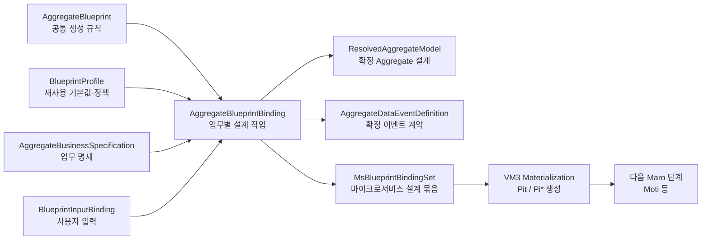
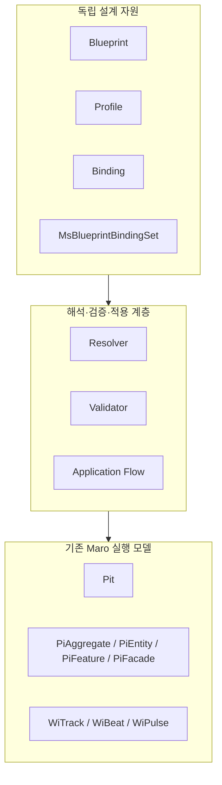
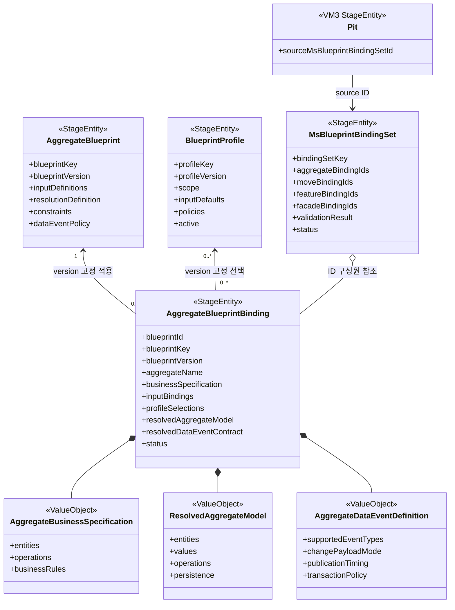
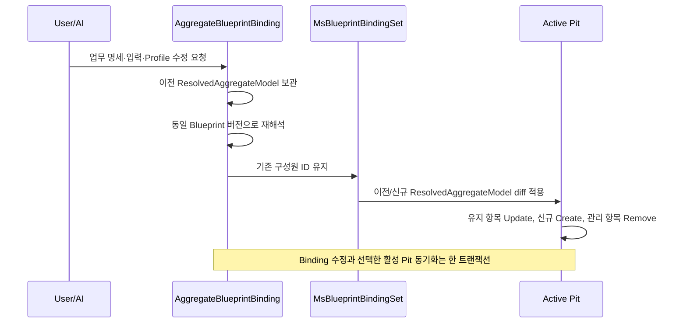

# Maro Blueprint 전체 개념과 흐름

> 기준일: 2026-09-07  
> 적용 범위: `maro-back`의 Blueprint Binding 및 VM3 Materialization  
> 핵심 모델: `AggregateBlueprint`, `BlueprintProfile`, `AggregateBlueprintBinding`, `MsBlueprintBindingSet`, `ResolvedAggregateModel`, `AggregateBusinessSpecification`, `AggregateDataEventDefinition`

오프라인 웹 문서: [blueprint-concepts-and-flow.html](./blueprint-concepts-and-flow.html)

## 1. 한눈에 보기

Blueprint는 기존 VM3 모델인 `Pit`, `PiAggregate`, `PiEntity`, `PiFeature`, `PiFacade` 등을 만들기 전에 존재하는 **재사용 가능한 설계 메타모델**이다.



핵심 원칙은 다음과 같다.

1. Blueprint는 특정 업무가 아니라 공통 생성 규칙을 가진다.
2. 주문·결제 같은 업무 내용은 Binding의 업무 명세에 둔다.
3. Profile은 Blueprint의 하위 객체가 아닌 독립 `StageEntity`다.
4. Binding은 선택한 Blueprint와 Profile의 정확한 ID·key·version을 고정한다.
5. 같은 업무 설계의 변경은 기존 Binding ID를 유지하면서 허용된 설계 필드를 수정한다.
6. BindingSet 포함 여부와 Materialization 이력은 Binding 수정 가능 여부를 제한하지 않는다.
7. Aggregate, Move, Feature, Facade Binding은 서로 물리 FK를 갖지 않는다.
8. `MsBlueprintBindingSet`이 마이크로서비스 범위의 Binding들을 묶고 교차 검증한다.
9. 다음 단계는 Binding을 직접 사용하지 않고 Materialize된 VM3를 사용한다.
10. Blueprint에는 runtime `lineageId`, `prId`, `pitId`, `dramaId`를 두지 않는다.
11. Pit은 개별 Binding이 아니라 `sourceMsBlueprintBindingSetId`를 생성 출처로 보존한다.
12. 새 PR의 Pit은 직전 최신 PR Pit의 BindingSet 참조를 snapshot하여 동일 Binding ID들을 이어받는다.

---

## 2. Blueprint가 필요한 이유

### 기존 방식

```text
사용자가 Entity 값을 직접 입력
→ Entity 생성 중 Aggregate 지정
→ PiEntity/PiAggregate 등 VM3 생성
```

이 방식은 생성 결과만 남기 때문에 같은 설계를 다른 업무나 새로운 PR에 일관되게 재사용하기 어렵다.

### Blueprint 방식

```text
공통 생성 규칙 정의
→ 업무 명세와 Profile을 Binding에 결합
→ 최종 Aggregate 설계 resolve
→ VM3 materialize
→ 동일 설계 재사용 및 변경 동기화
```

Blueprint 방식에서는 “무엇을 생성했는가”뿐 아니라 “어떤 규칙과 업무 결정으로 생성했는가”가 보존된다.

---

## 3. 핵심 용어

| 용어 | 정의 | 소유하면 안 되는 것 |
|---|---|---|
| Blueprint | 재사용 가능한 공통 생성 규칙 | 주문 같은 업무값, PR/Pit, runtime lineage |
| BlueprintProfile | 여러 Binding에서 선택할 수 있는 기본값과 정책 묶음 | 특정 Blueprint 소유 관계, 업무 Entity 구조 |
| BlueprintBinding | 특정 업무에 Blueprint와 Profile을 적용한 설계 작업 단위 | PR/Pit 소유 키, 암묵적인 최신 Blueprint |
| DesignWork / AuthoringSession | 사용자와 AI가 설계하는 동안의 후보·오류·미해결 상태 | 완료된 VM3 결과로 오인할 수 있는 상태 |
| ResolvedAggregateModel | 검증과 해석이 끝난 순수 Aggregate 설계 | runtime VM3 ID와 lineage |
| MsBlueprintBindingSet | 한 마이크로서비스 범위의 Binding 구성 및 교차 검증 경계 | Pit/PR 소유 관계, 개별 Binding 책임의 흡수 |
| VM3 | 기존 Maro 메타모델 (`Pit`, `Pi*`, `Wi*`, `At*`) | Blueprint 규칙의 중복 정의 |
| Materialization | 검증된 Binding 설계를 VM3로 변환하는 과정 | 업무 명세 재해석, 임의 기본값 적용 |

---

## 4. 설계 레이어와 의존 방향



허용되는 코드 의존 방향은 다음과 같다.

```text
blueprint domain ← resolver/application layer ← VM3 materializer
```

`io.vizend.maro.domain.blueprint..`는 Geno, Pit, Pr 또는 Pi 모델을 import하지 않는다. 반대로 Materializer와 Application Flow는 Blueprint 모델을 소비할 수 있다.

---

## 5. 핵심 모델

### 5.1 AggregateBlueprint

모든 Aggregate 설계에 재사용할 수 있는 **공통 기준 Blueprint**다. “주문 Aggregate” 같은 업무 설계가 아니라 Aggregate를 해석하고 생성하는 방법을 정의한다.

| 필드 | 의미 |
|---|---|
| `blueprintKey` | Blueprint 종류의 논리 키 |
| `blueprintVersion` | 공통 규칙 버전 |
| `blueprintName` | 표시 이름 |
| `description` | 목적과 적용 설명 |
| `inputDefinitions` | Binding이 받을 입력 스키마 |
| `resolutionDefinition` | 입력, ID, Version, SDO를 해석하는 실행 규칙 |
| `constraints` | 모든 결과가 만족해야 하는 전역 제약 |
| `dataEventPolicy` | Binding별 데이터 이벤트 계약의 허용 기준 |

ID는 다음과 같이 결정적으로 생성한다.

```text
{blueprintKey}:{blueprintVersion}

예: aggregate.standard:3
```

공통 규칙을 변경할 때는 기존 버전을 덮어쓰지 않고 새 `blueprintVersion`을 등록한다. 기존 Binding은 자신이 고정한 버전을 계속 사용한다.

### 5.2 AggregateResolutionDefinition

Blueprint를 실행 가능한 규칙으로 만드는 핵심 ValueObject다.

```text
AggregateResolutionDefinition
├─ 입력 키 매핑
│  ├─ packagePathInputKey
│  ├─ aggregateModelVersionInputKey
│  ├─ entityTypeInputKey
│  ├─ modelTypeInputKey
│  └─ storeTypeInputKey
├─ 기본 정책
│  ├─ optimistic lock
│  ├─ transaction
│  ├─ change payload
│  ├─ publication timing
│  └─ lifecycle
├─ entityRule
│  ├─ identifier field mode
│  ├─ identifier strategy
│  ├─ version field mode
│  └─ generated field templates
└─ dataObjectTemplates[]
   ├─ CDO
   ├─ UDO
   ├─ DDO
   ├─ RDO
   └─ FDO
```

Resolver는 `blueprintKey`를 보고 하드코딩된 구현을 선택하지 않는다. 선택된 Blueprint의 `resolutionDefinition`을 그대로 실행한다.

### 5.3 BlueprintProfile

Blueprint 적용 시 재사용하는 기본값과 정책 묶음이다. Blueprint 바깥의 독립 `StageEntity`다.

| 필드 | 의미 |
|---|---|
| `profileKey` | Profile 논리 키 |
| `profileVersion` | Profile 내용 버전 |
| `name`, `description` | 표시 정보 |
| `scope` | Aggregate, Entity, HistoryModel 등 적용 범위 |
| `inputDefaults` | 사용자가 생략한 Blueprint 입력의 기본값 |
| `policies` | 대상 경로에 기본·제약·강제 적용할 구조화 정책 |
| `constraints` | Profile 적용 결과의 유효성 제약 |
| `tags` | 검색과 분류용 메타데이터 |
| `active` | Binding 생성·수정 시 선택 가능 여부 |

ID는 다음과 같다.

```text
{profileKey}:{profileVersion}

예: aggregate.standard.jpa:2
```

Profile은 Blueprint를 소유하거나 참조하지 않는다. Binding이 Profile ID·key·version을 선택한다.

### 5.4 AggregateBusinessSpecification

사용자가 업무 언어로 입력한 원본 명세다.

```text
AggregateBusinessSpecification
├─ specificationKey / title
├─ aggregateName
├─ purpose / boundary / narrative
├─ rootEntityKey
├─ entities[]
│  └─ fields[]
├─ operations[]
├─ businessRules[]
└─ lifecycleStates[]
```

이 모델은 원본을 보존한다. Resolver가 만든 `ResolvedAggregateModel`로 덮어쓰지 않는다.

### 5.5 AggregateBlueprintBinding

공통 Blueprint에 특정 업무 명세, 입력값과 Profile을 결합한 **업무별 설계 작업 단위**다.

| 필드 | 변경 여부 | 의미 |
|---|---:|---|
| `blueprintId` | 고정 | 선택한 Blueprint ID |
| `blueprintKey` | 고정 | Blueprint 논리 키 스냅샷 |
| `blueprintVersion` | 고정 | 선택한 Blueprint 버전 |
| `aggregateName` | 고정 | Aggregate 정체성 |
| `businessSpecification` | 변경 가능 | 사용자의 업무 명세 |
| `inputBindings` | 변경 가능 | Blueprint 입력별 값과 출처 |
| `profileSelections` | 변경 가능 | 선택한 Profile의 ID·key·version·우선순위 |
| `resolvedAggregateModel` | 재해석 시 갱신 | 최종 Aggregate 설계 |
| `resolvedDataEventContract` | 재해석 시 갱신 | 최종 이벤트 계약 |
| `validationResult` | 검증 시 갱신 | 오류와 검증 결과 |
| `status` | 변경 가능 | Draft / Validated / Resolved / Failed |

같은 업무 설계의 변경은 새 Binding을 만드는 것이 아니라 **기존 Binding ID를 유지한 채 변경 가능한 필드를 다시 resolve하여 갱신**한다.

새 Binding이 필요한 경우는 Aggregate 정체성이 달라지거나 다른 Blueprint ID/key/version으로 명시적으로 전환해야 할 때다.

### 5.6 ResolvedAggregateModel

Materializer가 소비하는 최종 설계다. 실제 Java 클래스명은 반드시 `ResolvedAggregateModel`이다.

```text
ResolvedAggregateModel
├─ aggregateKey / aggregateName
├─ packagePath / modelVersion
├─ rootEntityKey
├─ entities[]
│  ├─ fields[]
│  ├─ dataObjects[]
│  └─ storeMethods[]
├─ values[]
├─ operations[]
├─ stateTransitions[]
├─ invariants[]
└─ persistence
```

내부 참조는 `aggregateKey`, `entityKey`, `fieldKey`, `objectKey`, `operationKey` 같은 의미 키로 연결한다. VM3 물리 ID나 runtime lineage를 넣지 않는다.

### 5.7 AggregateDataEventPolicy와 AggregateDataEventDefinition

두 모델은 책임이 다르다.

| 모델 | 위치 | 책임 |
|---|---|---|
| `AggregateDataEventPolicy` | AggregateBlueprint | 허용 시점, payload 방식, 트랜잭션과 필수 조건 |
| `AggregateDataEventDefinition` | AggregateBlueprintBinding | 업무별 이벤트 이름, 값 결합 경로와 최종 계약 |

```text
Policy: “Update 이벤트와 entityVersion이 반드시 필요하다.”
Definition: “OrderUpdated가 orderId, entityVersion, commandId를 이 경로에서 읽는다.”
```

### 5.8 MsBlueprintBindingSet

한 마이크로서비스 개발 범위의 독립 Binding들을 묶는 `StageEntity`다.

```text
MsBlueprintBindingSet
├─ bindingSetKey
├─ aggregateBindingIds[]
├─ moveBindingIds[]
├─ featureBindingIds[]
├─ facadeBindingIds[]
├─ queryModelBindingIds[]
├─ historyBindingIds[]
├─ eventBindingIds[]
├─ validationResult
└─ status
```

ID 형식은 다음과 같다.

```text
ms-blueprint-binding-set:{bindingSetKey}
```

Binding 간에 FK를 직접 만들지 않는 이유는 다음과 같다.

- 각 Binding의 독립적인 설계 책임을 유지한다.
- Facade/Feature/Move/Aggregate의 순환 소유 관계를 막는다.
- 설계 중간 저장과 타입별 CRUD를 독립적으로 지원한다.
- Set 단위로 교차 검증하고 원자적으로 Materialize할 수 있다.

### 5.9 Pit

Pit은 Blueprint 모델이 아니라 Blueprint를 통해 만들어지는 downstream VM3 컨테이너다.

```text
Pit.sourceMsBlueprintBindingSetId
```

이 필드는 Pit 전체를 만든 마이크로서비스 설계 묶음을 가리킨다. 개별 Aggregate Binding ID는 Set의 구성원 목록을 통해 찾는다.

---

## 6. 모델 관계도



---

## 7. 전체 생성 흐름

### 7.1 카탈로그 준비

```text
AggregateBlueprint 등록
BlueprintProfile 등록
```

- Blueprint는 실행 가능한 `resolutionDefinition`을 가져야 한다.
- Profile은 독립적으로 등록하며 사용할 정확한 버전을 Binding이 선택한다.
- 표준 샘플은 `scripts/blueprint`의 SQL로 등록할 수 있다.

### 7.2 업무 설계 입력

```text
사용자/AI
├─ Aggregate 업무 목적과 경계 입력
├─ Root/Child Entity 후보 입력
├─ Field와 Operation 입력
├─ AggregateBlueprint 선택
├─ BlueprintProfile 선택
└─ Blueprint 입력값 입력
```

설계 도중 중단과 재개가 필요하면 DesignWork/AuthoringSession에 후보 상태를 둔다. 현재 Aggregate 단독 구현은 Binding의 Draft 상태도 사용할 수 있지만, 완료된 VM3 생성에는 Resolved 상태만 사용한다.

### 7.3 Binding resolve

입력 해석 우선순위는 결정적이어야 한다.

```text
1. Blueprint fixedValue
2. 사용자가 명시한 BlueprintInputBinding
3. 선택한 Profile의 inputDefaults와 policies
4. Blueprint defaultValue
5. Blueprint derivationRule 계산값
```

그 다음 다음 순서로 해석한다.

```text
Blueprint/Profile ID·key·version 일치 검증
→ Profile 우선순위 정렬 및 충돌 검증
→ 필수 입력과 타입 검증
→ Aggregate Root/Child/Field 해석
→ ID와 Version 필드 결정
→ Blueprint dataObjectTemplates로 SDO 결정
→ Operation/State/Invariant/Persistence 확정
→ DataEventPolicy 범위 안에서 이벤트 계약 확정
→ 최종 모델 검증
→ Binding 상태를 Resolved로 전환
```

### 7.4 BindingSet 구성

```text
AggregateBlueprintBinding[]
MoveBlueprintBinding[]
FeatureBlueprintBinding[]
FacadeBlueprintBinding[]
선택적 Query/History/Event Binding[]
        ↓
MsBlueprintBindingSet
        ↓ 교차 검증
Resolved
```

Aggregate 단독 호환 API에서 Set이 없다면 Aggregate-only `MsBlueprintBindingSet`을 먼저 만든 뒤 Set 기반 Materialization으로 위임한다.

### 7.5 VM3 Materialization

권장 생성 순서는 다음과 같다.

```text
Pit
→ PiDomain
→ PiAggregate[]
→ PiEntity / PiEntityVo / PiField
→ PiEntity CDO / UDO / DDO / FDO / RDO / OptionStore
→ PiFeature
→ PiFlow / PiSeek / PiLoad
→ PiFacade
→ PiCommandRequest / PiFetchRequest / PiQueryRequest
→ PiFeature SDO / VO / Method
→ lineage 및 교차 참조 검증
```

현재 구현은 Aggregate Binding을 통한 Pit Domain 영역 Materialization을 지원한다. Move/Feature/Facade 등이 Set에 포함된 완전한 Set Materialization은 해당 Materializer가 구현되기 전까지 명시적으로 실패한다.

### 7.6 다음 단계

```text
MsBlueprintBindingSet
→ Pit/Pi* VM3
→ Moti는 기존 방식으로 Pit/Pi* 조회
→ TrackBlueprintBinding
→ Wings/WiTrack/WiBeat/WiPulse/WiArchive
```

Moti는 Aggregate Binding이나 BindingSet을 직접 다음 단계 입력으로 사용하지 않는다.

---

## 8. SDO 생성 방식

CDO, UDO, DDO, RDO, FDO의 생성 여부와 형태는 Resolver 코드의 Blueprint key 분기로 결정하지 않는다.

```text
AggregateBlueprint.resolutionDefinition.dataObjectTemplates
        +
AggregateBusinessSpecification의 Entity/Field
        ↓ Resolver
AggregateDataObjectDefinition[]
        ↓ Materializer
PiEntityCdo/Udo/Ddo/Rdo/Fdo
```

각 템플릿은 다음을 지정한다.

- 객체 타입
- object key와 이름 패턴
- 필드 투영 방식
- 고정 요청 필드
- ID 전략의 출처

Materializer는 이미 확정된 `AggregateDataObjectDefinition`을 손실 없이 변환할 뿐 SDO 종류를 다시 판단하지 않는다.

---

## 9. Binding 수정과 Pit 동기화

Materialization 여부는 Binding의 수정 가능 여부를 결정하지 않는다. Binding은 여러 PR의 Pit VM3 snapshot에 걸쳐 같은 ID로 유지되는 독립 설계 자원이며, 언제든 같은 ID의 변경 가능한 필드를 수정할 수 있다.

### 카탈로그에서 Binding만 수정

```text
기존 Binding 조회
→ 동일 Blueprint 버전으로 다시 resolve
→ 동일 Binding ID의 변경 가능 필드 갱신
→ 기존 Pit VM3 snapshot은 그대로 유지
```

카탈로그에는 특정 PR/Pit 문맥이 없으므로 Binding 설계만 수정한다. 변경된 설계를 Pit VM3에 적용하려면 해당 활성 Pit에서 명시적으로 동기화한다.

### Pit 문맥에서 Binding 수정과 동기화



Binding이 이미 한 번 이상 Materialize되었거나 BindingSet의 구성원이라는 이유로 수정을 거부하지 않는다. Pit 화면에서 수정한 경우에만 선택한 활성 Pit의 VM3 snapshot을 같은 요청에서 동기화한다.

변경 시 유지해야 하는 값:

- Binding ID
- `blueprintId`, `blueprintKey`, `blueprintVersion`
- `aggregateName`
- `MsBlueprintBindingSet` ID
- `Pit.sourceMsBlueprintBindingSetId`
- 동일 의미 VM3의 runtime lineage

수정할 수 있는 값:

- 업무 명세
- Blueprint 입력값
- Profile 선택
- 해석 결과
- 이벤트 계약
- 검증 결과와 상태

---

## 10. PR snapshot과 독립성

Blueprint, Profile, Binding과 BindingSet은 PR 소유 자원이 아니다.

```text
새 PR 생성
→ 직전 최신 PR의 Pit/Pi*를 새 Pit/Pi* snapshot으로 복사
→ 직전 최신 Pit의 sourceMsBlueprintBindingSetId 복사
→ 같은 BindingSet이 가진 동일 Binding ID들을 계속 참조

새 PR + 이후 업무 변경 있음
→ 같은 Binding ID에서 업무 설계 수정
→ 이전/신규 ResolvedAggregateModel 비교
→ 새 PR의 활성 Pit 동기화
→ 같은 sourceMsBlueprintBindingSetId 유지
```

PR이 새로 생겼다는 이유만으로 Blueprint, Profile, Binding 또는 BindingSet Entity를 복제하지 않는다. “Binding ID를 snapshot으로 복사한다”는 것은 새 Pit이 직전 최신 Pit의 `sourceMsBlueprintBindingSetId`를 복사하고, 그 Set의 동일 구성원 Binding ID를 계속 해석한다는 뜻이다.

---

## 11. Lineage와 출처 추적

### Blueprint 내부

- runtime `lineageId`를 갖지 않는다.
- 논리 참조는 `entityKey`, `fieldKey`, `operationKey`, `objectKey`로 표현한다.
- Pi CDO의 lineage를 미리 정하지 않는다.

### Geno 등록 시점

```text
실제 Drama/Pit/부모 lineage + 이름·경로
→ LineageKeyBuilder
→ 최종 Pi lineageId
```

### Pit 출처

```text
Pit.sourceMsBlueprintBindingSetId
→ MsBlueprintBindingSet.aggregateBindingIds[]
→ AggregateBlueprintBinding.blueprintId
→ AggregateBlueprint
```

이 경로로 생성된 VM3에서 사용된 Blueprint와 업무 설계를 역추적할 수 있다.

---

## 12. Aggregate, Move, Feature, Facade 설계 순서

사용자 관점과 의존성 해석 관점을 구분한다.

### 사용자 경험: 바깥에서 안으로

```text
Facade/API 요구
→ Feature UseCase
→ Move 흐름
→ Aggregate Operation과 상태 설계
```

사용자는 외부 기능과 업무 목적부터 설명하는 편이 자연스럽다.

### 확정·검증: 안에서 밖으로

```text
Aggregate Contract 확정
→ Move target resolve
→ Feature MoveComposition resolve
→ Facade featureOperationRef resolve
```

따라서 설계 입력은 Facade부터 받을 수 있지만, 최종 Binding resolve와 검증은 `Aggregate → Move → Feature → Facade` 순서가 안전하다.

논리 관계는 다음과 같다.

```text
FacadeOperationBinding → FeatureOperation ContractRef
FeatureOperationBinding → MoveComposition
MoveBlueprintBinding → Aggregate Operation ContractRef
```

직접 FK나 객체 소유 관계는 두지 않고 `MsBlueprintBindingSet`에서 교차 검증한다.

---

## 13. Query, History, Event Binding 생성 조건

### QueryModelBlueprintBinding

목록, 검색, 통계, 여러 Aggregate 조합 또는 Projection이 필요할 때 만든다. `PiQueryRequest`가 있다는 이유만으로 항상 만들지는 않는다.

### HistoryBlueprintBinding

Entity 변경 이력, 시점 조회, Lifecycle 또는 감사 추적이 필요할 때 만든다. Aggregate의 Data Event Contract를 기준으로 구성한다.

### EventBlueprintBinding

업무 변화를 다른 Drama, 서비스 또는 Broker로 발행할 때 만든다. 내부 Data Event와 외부 Domain Event를 구분한다.

---

## 14. 상태와 검증

### Binding 상태

```text
Draft → Validated → Resolved
   └──────────────→ Failed
```

- Draft: 입력 중이거나 입력 검증만 수행된 상태
- Validated: 입력 및 설계 검증을 통과한 상태
- Resolved: Materialization 가능한 최종 해석 상태
- Failed: 검증 또는 해석에 실패한 상태

### 핵심 검증

- Blueprint/Profile의 ID·key·version 일치
- 필수 입력과 허용 source 검증
- Profile 중복과 같은 우선순위 충돌 검증
- Aggregate Root 정확히 하나
- Child 소유 관계의 존재성과 비순환성
- 모든 Entity의 ID 및 필요한 Version 결정
- Operation, Field, Value, State, Invariant 참조 유효성
- SDO 타입과 필드 투영의 호환성
- Event Policy와 최종 Event Definition 호환성
- BindingSet 구성원 존재성과 Resolved 상태
- Facade→Feature→Move→Aggregate 논리 참조 해석

검증 실패를 최신 버전 자동 선택이나 임의 기본값으로 숨기지 않는다.

---

## 15. 모듈별 책임

| 모듈 | 책임 |
|---|---|
| `maro-domain` | Blueprint Entity, CDO, ValueObject, Validator, Logic/Store 계약 |
| `maro-feature` | 조회·선택·resolve·검증·Binding 수정·Materialization 조합 |
| `maro-store-jpa` | Blueprint/Profile/Binding/BindingSet 영속화 |
| `maro-facade` | Command/Fetch API 노출 |
| `maro-code-gen` | 검증된 해석 결과를 코드 산출물로 변환 |
| `maro-boot` | API와 런타임 조립 |
| `maro-mcp` | 도구 입력을 정본 Blueprint 계약에 연결 |
| `maro-front` | 카탈로그 및 Binding CRUD, Pit 생성·동기화 UI |

---

## 16. 현재 구현된 API와 화면

### 조회

- Aggregate Blueprint 목록
- Blueprint Profile 목록
- Aggregate Binding 목록 및 단건 조회
- Pit의 `sourceMsBlueprintBindingSetId`를 통한 Aggregate Binding 조회

### 명령

- Aggregate Blueprint 등록·표시 정보 수정·삭제
- Blueprint Profile 등록·표시 정보/활성 상태 수정·삭제
- Aggregate Binding 생성
- Materialization 여부와 무관한 동일 Aggregate Binding ID 수정
- Aggregate-only BindingSet 생성 및 Pit IR 생성
- Aggregate Binding 수정과 선택한 활성 Pit 동기화

### 화면

- Blueprint Management
  - Aggregate Bindings
  - Aggregate Blueprints
  - Blueprint Profiles
- Pit View의 Blueprint 기반 Pit IR 생성·동기화 다이얼로그

삭제 시 참조 무결성을 보호한다.

- Binding이 참조하는 Blueprint/Profile은 삭제할 수 없다.
- BindingSet에 포함된 Binding은 독립 삭제할 수 없다.
- BindingSet 포함 여부나 Materialization 여부와 무관하게 Binding은 같은 ID에서 수정할 수 있다.
- 카탈로그 수정은 Binding만 갱신하고, Pit 화면의 수정은 선택한 활성 Pit 동기화까지 함께 수행한다.

---

## 17. 현재 구현 범위와 확장 방향

| 영역 | 현재 상태 |
|---|---|
| Aggregate Blueprint/Profile/Binding 모델 | 구현됨 |
| Aggregate Resolver/Validator | 구현됨 |
| Aggregate → Pit/Pi* Materialization | 구현됨 |
| MsBlueprintBindingSet Aggregate 구성 및 검증 | 구현됨 |
| Aggregate-only 호환 API | 구현됨 |
| Move/Feature/Facade Binding 모델·Materializer | 확장 대상 |
| Query/History/Event Binding 모델·Materializer | 필요 시 확장 대상 |
| 전체 Set 교차 검증 | 각 Binding 모델 도입과 함께 확장 |
| Materialization 실행 이력 전용 모델 | 권장 구조이며 추가 구현 대상 |

`AggregateBlueprintPatterns`, `AggregateGenerationPlan`, `AggregateCompatibilityPolicy`, `AggregateLogicBinding`, 범용 `extensionPoints`는 구체적인 Spec과 Resolver 규칙이 마련되기 전에는 핵심 모델에 연결하지 않는다.

---

## 18. 주문 Aggregate 예시

```text
AggregateBlueprint
  aggregate.standard:3
  - ID/Version 결정 규칙
  - CDO/UDO/DDO/RDO/FDO 템플릿
  - 데이터 이벤트 정책

BlueprintProfile
  aggregate.standard.jpa:2
  - StageEntity
  - JPA
  - Optimistic Lock Required

AggregateBusinessSpecification
  - aggregateName: Order
  - root: Order
  - child: OrderLine
  - operations: createOrder, changeAddress, cancelOrder

        ↓ resolve

AggregateBlueprintBinding
  - Blueprint/Profile 버전 고정
  - Order 업무 명세와 입력 보존
  - ResolvedAggregateModel
  - Order 데이터 이벤트 계약

        ↓ MsBlueprintBindingSet에 추가
        ↓ materialize

Pit
└─ PiDomain
   └─ PiAggregate Order
      ├─ PiEntity Order
      ├─ PiEntity OrderLine
      ├─ PiField...
      ├─ PiEntityCdo/Udo/Ddo/Rdo/Fdo
      └─ PiOptionStore
```

같은 Blueprint와 Profile을 다른 업무 명세에 적용하면 Product, Customer 등의 Aggregate도 동일한 기술 기준으로 생성할 수 있다.

---

## 19. 금지 사항

- Blueprint에 주문·결제 같은 특정 업무 구조 저장
- Blueprint/Profile/Binding을 PR 또는 Pit이 소유하게 설계
- Binding에 `prId`, `pitId`, `dramaId` 추가
- Blueprint 또는 Resolved 모델에 최종 lineage 저장
- Resolver가 Blueprint key로 하드코딩 분기
- Materializer가 원본 업무 문장이나 Profile을 다시 추론
- 최신 Blueprint/Profile 버전으로 암묵 치환
- Aggregate Binding이 Facade/Feature/Move Binding을 소유
- Facade가 Aggregate/Move/Store를 직접 호출
- Move가 Aggregate 내부 필드를 직접 변경
- 화면·API 임시 필드를 무조건 Entity 필드로 변환
- 검증되지 않은 범용 Map 또는 extension point 추가

---

## 20. 작업 체크리스트

### 설계 전

- 이 데이터가 공통 규칙인지 업무별 값인지 구분했는가?
- Blueprint/Profile의 정확한 ID·key·version을 선택했는가?
- Aggregate 경계와 Root를 설명할 수 있는가?

### Resolve 전

- 필수 입력이 모두 존재하는가?
- Profile 우선순위와 충돌이 결정적인가?
- Root/Child/Field/Operation 참조가 유효한가?
- Event Policy를 만족하는가?

### Materialize 전

- Binding과 BindingSet이 Resolved 상태인가?
- `ResolvedAggregateModel`만 생성 입력으로 사용하는가?
- Pi CDO의 lineage를 비워 두었는가?
- 반복 실행이 중복 모델을 생성하지 않는가?

### 수정·동기화 전

- 기존 Binding ID와 Blueprint 정체성을 유지하는가?
- 이전 `ResolvedAggregateModel`을 비교 기준으로 보관했는가?
- 사용자 수동 모델을 삭제 대상으로 오인하지 않는가?
- Pit의 `sourceMsBlueprintBindingSetId`가 유지되는가?

---

## 21. 관련 파일

- 모델 계약: `maro-domain/BLUEPRINT_IMPLEMENTATION_GUIDE.md`
- AI 작업 지침: `AGENTS.md`, `maro-domain/AGENTS.md`
- 도메인 모델: `maro-domain/src/main/java/io/vizend/maro/domain/blueprint`
- Resolver/Materializer: `maro-feature/src/main/java/io/vizend/maro/feature/blueprint`
- Pit 적용 흐름: `maro-feature/src/main/java/io/vizend/maro/feature/geno/pit/action/BlueprintPitIrGenerationAction.java`
- REST API: `maro-facade/src/main/java/io/vizend/maro/facade/api/role/app/blueprint`
- 표준 샘플 SQL: `scripts/blueprint`
